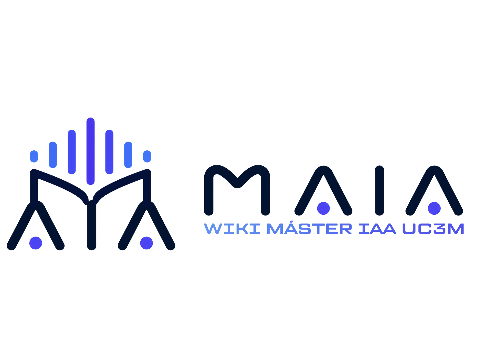

# MAIA — Wiki del Máster en Inteligencia Artificial Aplicada (UC3M)

<p align="center">
  
</p>

> **English:** This repository hosts the **student-maintained wiki** and AI tooling for the **MSc in Applied Artificial Intelligence** at **Universidad Carlos III de Madrid (UC3M)**. Developed by **Jorge Garcelán** in his capacity as **student representative** (*delegado*) — a practical resource for classmates and future students, not an official publication of the University.

El **Máster Universitario en Inteligencia Artificial Aplicada (MAIA)** se imparte en la **Escuela de Postgrado en Ingeniería y Ciencias Básicas**, campus **Madrid — Puerta de Toledo**, en modalidad **presencial** (**60 ECTS**, en **español**).

Este repositorio centraliza documentación útil (plan de estudios, asignaturas, horarios, prácticas, FAQ, contactos…) y **skills** (instrucciones para el agente) para **Cursor** o **Claude**: clonas el repo, conectas las skills y el agente responde leyendo la `wiki/`.

> **Importante:** la UC3M es la fuente de verdad para normativa, calendarios y precios. Si hay discrepancia entre esta wiki y la web oficial o la secretaría, **prevalece siempre la información oficial**.

### Solo quiero leer en GitHub

Sin herramientas de IA: abre el [**índice de la wiki**](wiki/README.md) en GitHub y navega por los `.md`, o pulsa `/` en el repo para **Ir al archivo** (*Go to file*).

---

## Usar la wiki con IA

Flujo recomendado: **tener el repositorio en tu ordenador**, **hacer que Cursor o Claude carguen las skills** del proyecto y **preguntar al agente** en lenguaje natural; el agente leerá `wiki/` y los archivos que indiquen las skills.

1. **Clona el repositorio** (o descárgalo como ZIP y descomprime).
   ```bash
   git clone https://github.com/jorgegarcelan/maia-uc3m-wiki.git
   cd maia-uc3m-wiki
   ```
2. **Cursor:** abre esta carpeta como proyecto (**File → Open Folder**). Las skills están en [`.cursor/skills/`](.cursor/skills/). En el chat del agente, invoca una skill con `@` y el nombre de la carpeta (por ejemplo `@maia-wiki`).
3. **Claude (Claude Code u otras apps que usen `SKILL.md`):** tu cliente suele buscar skills en **`.claude/skills/`** dentro del proyecto o en tu carpeta de usuario. Para no duplicar ficheros, puedes **copiar** las carpetas desde `.cursor/skills/` a `.claude/skills/` en la raíz del clon, o crear **enlaces simbólicos** desde `.claude/skills/` apuntando a cada skill en `.cursor/skills/`. Consulta la documentación de tu versión de Claude por si la ruta exacta difiere.
4. **Pregunta al agente** (horarios, optativas, plan de créditos, compatibilidad laboral, etc.). Para planes o tablas complejas, suele funcionar mejor mencionar la skill adecuada (por ejemplo `@plan-master` o `@comparador-horarios`).

Si algo no cuadra con la web de la UC3M o la secretaría, **manda siempre sobre la información oficial**.

---

## Resumen del máster

| Concepto | Detalle |
|----------|---------|
| Créditos totales | 60 ECTS |
| Asignatura obligatoria | 3 ECTS — *Implicaciones Éticas y Legales de la IA* |
| Optativas | 45 ECTS (Módulo 1: 15–24 ECTS · Módulo 2: 18–30 ECTS) |
| Prácticas externas | 6 ECTS |
| TFM | 6 ECTS |
| Duración | 1 año académico (4 semicuatrimestres) |
| Horario | Tardes, 16:00–21:00 |
| Plazas | 40 |
| Precio UE | 130 €/ECTS (7.800 € total) |
| Precio no UE | 195 €/ECTS (11.700 € total) |

---

## Estructura del repositorio

```
MAIA/
├── static/                 # Logotipos MAIA (PNG)
├── .github/                # Plantillas de issues para contribuciones
├── wiki/                   # Documentación completa del máster
│   ├── README.md           # Índice general de la wiki
│   ├── plan-de-estudios.md
│   ├── asignaturas.md      # Catálogo completo (~25 fichas individuales)
│   ├── asignaturas/        # Una ficha .md por asignatura
│   ├── semicuatrimestres.md
│   ├── horarios.md
│   ├── admision-y-requisitos.md
│   ├── matricula-y-precios.md
│   ├── becas.md
│   ├── complementos-formativos.md
│   ├── practicas-tfm.md
│   ├── campus.md
│   ├── recursos-herramientas.md
│   ├── faq.md
│   ├── profesorado.md
│   ├── doble-master.md
│   └── contactos.md
├── ejemplos/               # Preguntas y respuestas de ejemplo
├── CONTRIBUTING.md         # Cómo proponer cambios (GitHub o delegación)
├── LICENSE                 # CC BY-SA 4.0
└── .cursor/skills/         # Skills del agente (Cursor; importables en Claude)
```

---

## Contenido

### [`wiki/`](wiki/README.md) — Documentación del máster

Wiki mantenida por la delegación de estudiantes. Cubre todo el ciclo del máster:

| Sección | Archivos |
|---------|----------|
| **Estructura académica** | Plan de estudios, catálogo de asignaturas (con fichas individuales), semicuatrimestres, horarios |
| **Información administrativa** | Admisión, matrícula, precios, becas, complementos formativos, prácticas y TFM |
| **Campus y recursos** | Campus Puerta de Toledo, software y herramientas por asignatura, FAQ, contactos |
| **Personas y programas** | Profesorado, doble máster (Ing. Informática + IA Aplicada) |

Entra por el [**índice de la wiki**](wiki/README.md).

---

### [`.cursor/skills/`](.cursor/skills/) — Skills del agente

Definen **qué debe hacer el agente** y **qué archivos leer** en `wiki/`. En **Cursor**, úsalas con `@nombre-de-la-carpeta`. En **Claude**, impórtalas según el paso 3 de [Usar la wiki con IA](#usar-la-wiki-con-ia).

| Skill | Qué hace |
|-------|----------|
| [`maia-wiki`](.cursor/skills/maia-wiki/SKILL.md) | Consulta general sobre cualquier aspecto del máster: asignaturas, horarios, admisión, profesorado, becas… |
| [`plan-master`](.cursor/skills/plan-master/SKILL.md) | Genera un plan de matrícula personalizado según tus intereses y restricciones |
| [`comparador-horarios`](.cursor/skills/comparador-horarios/SKILL.md) | Detecta solapamientos entre asignaturas y genera la parrilla semanal visual |
| [`itinerarios-tipo`](.cursor/skills/itinerarios-tipo/SKILL.md) | Recomienda itinerarios predefinidos por perfil profesional (ML Engineer, NLP, Robótica, etc.) |
| [`mapa-prerrequisitos`](.cursor/skills/mapa-prerrequisitos/SKILL.md) | Muestra las dependencias y el orden recomendado entre asignaturas |
| [`tracker-entregas`](.cursor/skills/tracker-entregas/SKILL.md) | Genera un tracker personalizado de entregas y evaluaciones por semicuatrimestre |

---

### [`ejemplos/`](ejemplos/README.md) — Ejemplos de consultas resueltas

Respuestas de muestra para que veas qué tipo de ayuda puedes obtener con la wiki y los skills.

| Ejemplo | Tema |
|---------|------|
| [01 — Asignaturas disponibles](ejemplos/01-asignaturas-disponibles.md) | Qué optativas encajan según módulos, ECTS y semicuatrimestres |
| [02 — Primer semicuatrimestre](ejemplos/02-primer-semicuatrimestre.md) | Obligatoria + optativas de M1 en S1 |
| [03 — Horarios S1](ejemplos/03-horarios-s1.md) | Parrilla semanal Grupo 1 y enlaces oficiales |
| [04 — Compatibilidad con trabajo](ejemplos/04-compatibilidad-trabajo-tardes.md) | Recomendaciones si trabajas hasta las 17:00 |

---

## Cómo usar este repositorio (resumen)

1. **Con IA:** sigue [Usar la wiki con IA](#usar-la-wiki-con-ia) (clonar → skills en Cursor o Claude → preguntar al agente).
2. **Solo lectura en GitHub:** [índice de la wiki](wiki/README.md) o archivos sueltos.
3. **Contribuir:** [*issue*](https://github.com/jorgegarcelan/maia-uc3m-wiki/issues/new/choose) o *pull request*; detalles en [**CONTRIBUTING.md**](CONTRIBUTING.md).

---

## Enlaces oficiales (UC3M)

- [Web del máster — IA Aplicada](https://www.uc3m.es/master/inteligencia-artificial-aplicada)
- [Horarios oficiales (plan 475)](https://aplicaciones.uc3m.es/horarios-web/publicacion/master.page?plan=475&centro=4)
- [Solicitud de admisión (PAA)](https://aplicaciones.uc3m.es/paa/login)
- [Secretaría Virtual](https://secretaria-virtual.uc3m.es/)
- [Aula Global](https://aulaglobal.uc3m.es/)
- [Calendario académico Postgrado 2025-2026](https://www.uc3m.es/ss/Satellite/Postgrado/es/TextoMixta/1371210936498/Calendario_academico)

---

## Créditos, licencia y mantenimiento

Wiki impulsada por **Jorge Garcelán** como **delegado de estudiantes** del MAIA (UC3M). El objetivo es que la información esté **centralizada**, **buscable** y **reutilizable** — incluso con asistentes de código.

Las fichas y datos académicos se basan en fuentes públicas de la UC3M y en el trabajo de la delegación.

El contenido del repositorio se publica bajo **CC BY-SA 4.0** ([`LICENSE`](LICENSE)): puedes compartir y adaptar citando la fuente y manteniendo la misma licencia en derivados.

---

*Curso de referencia: **2025/2026** — actualizar cuando comience el siguiente curso.*
