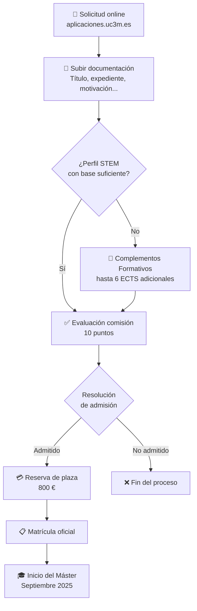

# Admisión y Requisitos

> [← Volver al índice](README.md)

---

## Perfil de Ingreso

El alumno debe tener una buena base de conocimientos en áreas **STEM** (Ciencia, Tecnología, Ingeniería y Matemáticas), así como capacidades en lenguajes de programación, hojas de cálculo y herramientas de ofimática.

### Tres tipos de alumnado

1. **Graduados recientes en Ingeniería Informática, Telecomunicaciones o Electrónica Industrial** interesados en IA con orientación profesional.
2. **Graduados del área STEM** con conocimientos suficientes para superar el plan de estudios.
3. **Ingenieros y licenciados STEM con experiencia profesional** en desarrollo software que quieren reciclarse hacia IA.

---

## Criterios de Admisión

| Criterio | Ponderación |
|----------|-------------|
| Expediente académico de los estudios de acceso | 7 puntos |
| Nivel de conocimiento de otros idiomas (B2 o equivalente) | 1 punto |
| Motivación, interés, cartas de recomendación | 1 punto |
| Otros | 1 punto |

> **Cartas de recomendación:** se reciben de forma confidencial a través de la aplicación de admisiones. Solo pueden ser enviadas por el recomendante tras solicitud del candidato. Deben recibirse hasta 3 días después del envío de la solicitud.

---

## Complementos Formativos

Si tu perfil no cubre los conocimientos necesarios, la comisión académica puede requerir **complementos formativos** (hasta 6 ECTS adicionales):

| Asignatura | ECTS | Código |
|------------|------|--------|
| Bases de Datos e Infraestructuras | 2 | [19358](https://aplicaciones.uc3m.es/cpa/generaFicha?est=378&asig=19358&idioma=1) |
| Programación Orientada a Objetos | 2 | [19359](https://aplicaciones.uc3m.es/cpa/generaFicha?est=378&asig=19359&idioma=1) |
| Razonamiento Estadístico | 2 | [19360](https://aplicaciones.uc3m.es/cpa/generaFicha?est=378&asig=19360&idioma=1) |

**Exención:** profesionales del sector con al menos 2 años de experiencia en las competencias indicadas no necesitan cursarlos.

→ Más detalles en [Complementos Formativos](complementos-formativos.md)

---

## Requisitos de Idiomas

Consulta los [requisitos de idiomas](https://www.uc3m.es/ss/Satellite/Postgrado/es/TextoMixta/1371210936498/) genéricos de la UC3M según si el máster se imparte en español, inglés o bilingüe. Este máster se imparte en **español**.

---

## Proceso de Solicitud

1. Accede a la [aplicación de admisiones](https://aplicaciones.uc3m.es/paa/login)
2. Sube la documentación requerida
3. Espera la resolución de la comisión académica
4. Si eres admitido, realiza la reserva de plaza (800 €)

### Documentación necesaria

- Título universitario (o certificado de finalización de estudios)
- Expediente académico con nota media
- DNI/Pasaporte
- Carta de motivación
- Cartas de recomendación (opcionales, pero puntuables)
- Certificado de idiomas (si aplica)

### Títulos extranjeros

Los estudiantes con títulos de fuera del EEES deben presentar:
- Título **legalizado** por vía diplomática o apostilla de La Haya
- Certificado de notas con nota media global, también legalizado
- Traducción oficial al castellano (si procede)

---

## Plazas

- **Plazas ofertadas:** 40
- **Estado admisión:** Consultar en la [web oficial](https://www.uc3m.es/master/inteligencia-artificial-aplicada)

---

*Fuente: [Admisión - Web del Máster UC3M](https://www.uc3m.es/master/inteligencia-artificial-aplicada#admision)*
