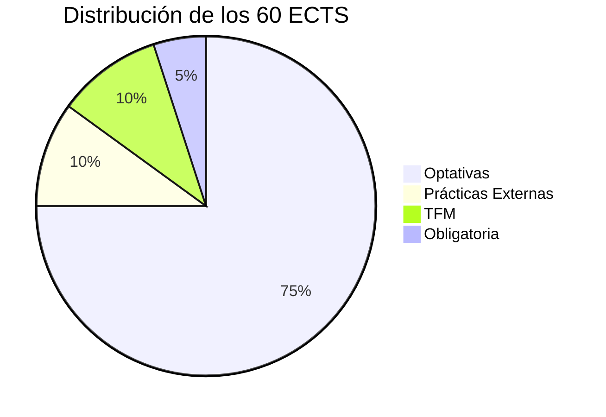
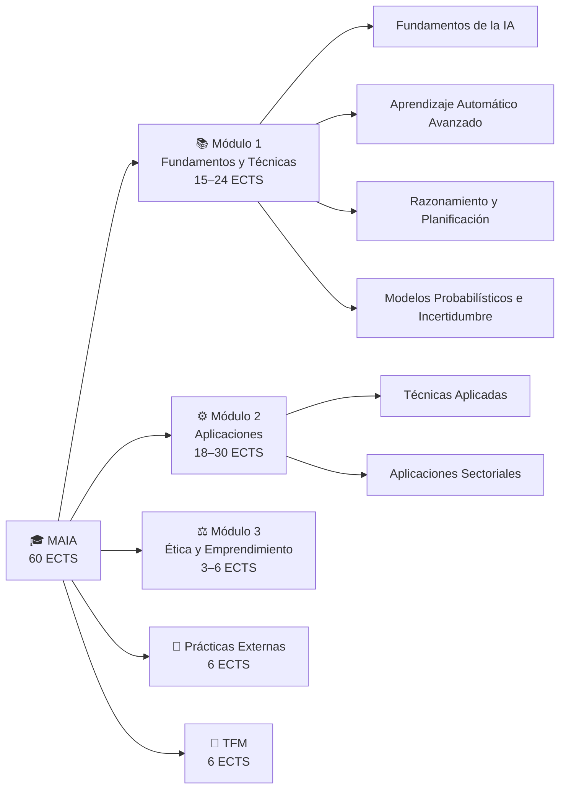

# Plan de Estudios

> [← Volver al índice](README.md)

El máster se estructura en **3 módulos** más Prácticas y TFM, con fuerte carácter optativo para que cada alumno adapte el itinerario a sus intereses.

---

## Distribución de Créditos

| Tipo | ECTS |
|------|------|
| Obligatoria (O) | 3 |
| Optativas (OP) | 45 |
| Prácticas Externas | 6 |
| Trabajo Fin de Máster | 6 |
| **Total** | **60** |

```mermaid
pie title Distribución de los 60 ECTS
    "Optativas" : 45
    "Prácticas Externas" : 6
    "TFM" : 6
    "Obligatoria" : 3
```

---

## Visión General del Plan

```mermaid
flowchart LR
    MAIA["🎓 MAIA\n60 ECTS"]

    M1["📚 Módulo 1\nFundamentos y Técnicas\n15–24 ECTS"]
    M2["⚙️ Módulo 2\nAplicaciones\n18–30 ECTS"]
    M3["⚖️ Módulo 3\nÉtica y Emprendimiento\n3–6 ECTS"]
    P["🏢 Prácticas Externas\n6 ECTS"]
    TFM["📄 TFM\n6 ECTS"]

    F1["Fundamentos de la IA"]
    F2["Aprendizaje Automático Avanzado"]
    F3["Razonamiento y Planificación"]
    F4["Modelos Probabilísticos e Incertidumbre"]

    A1["Técnicas Aplicadas"]
    A2["Aplicaciones Sectoriales"]

    MAIA --> M1
    MAIA --> M2
    MAIA --> M3
    MAIA --> P
    MAIA --> TFM

    M1 --> F1
    M1 --> F2
    M1 --> F3
    M1 --> F4

    M2 --> A1
    M2 --> A2
```

---

## Módulo 1 — Fundamentos y Técnicas

> Mínimo **15 ECTS** · Máximo **24 ECTS**

### Materia: Fundamentos de la IA
| Código | Asignatura | ECTS | Tipo | Semi |
|--------|-----------|------|------|------|
| 19204 | [Aprendizaje Automático](cursos/2026-2027/asignaturas/aprendizaje-automatico.md) | 3 | OP | S1 |
| 19200 | [Búsqueda y Optimización](cursos/2026-2027/asignaturas/busqueda-y-optimizacion.md) | 3 | OP | S1 |
| 19202 | [Computación Evolutiva](cursos/2026-2027/asignaturas/computacion-evolutiva.md) | 3 | OP | S1 |

### Materia: Aprendizaje Automático Avanzado
| Código | Asignatura | ECTS | Tipo | Semi |
|--------|-----------|------|------|------|
| 19199 | [Aprend. Automático en Series Temporales y Flujos de Datos](cursos/2026-2027/asignaturas/series-temporales.md) | 3 | OP | S1 |
| 19209 | [Aprendizaje por Refuerzo](cursos/2026-2027/asignaturas/aprendizaje-por-refuerzo.md) | 3 | OP | S2 |
| 19203 | [Redes de Neuronas](cursos/2026-2027/asignaturas/redes-de-neuronas.md) | 3 | OP | S1 |
| 19206 | [Aprendizaje Profundo](cursos/2026-2027/asignaturas/aprendizaje-profundo.md) | 3 | OP | S2 |

### Materia: Razonamiento y Planificación
| Código | Asignatura | ECTS | Tipo | Semi |
|--------|-----------|------|------|------|
| 19198 | [Representación del Conocimiento y Razonamiento](cursos/2026-2027/asignaturas/representacion-conocimiento.md) | 3 | OP | S1 |
| 19205 | [Agentes y Sistemas Multiagente](cursos/2026-2027/asignaturas/agentes-multiagente.md) | 3 | OP | S1 |
| 19207 | [Planificación Automática](cursos/2026-2027/asignaturas/planificacion-automatica.md) | 3 | OP | S2 |

### Materia: Modelos Probabilísticos e Incertidumbre
| Código | Asignatura | ECTS | Tipo | Semi |
|--------|-----------|------|------|------|
| 19201 | [Métodos Probabilísticos en IA](cursos/2026-2027/asignaturas/metodos-probabilisticos.md) | 3 | OP | S1 |
| 19208 | [Razonamiento con Incertidumbre](cursos/2026-2027/asignaturas/razonamiento-incertidumbre.md) | 3 | OP | S2 |

---

## Módulo 2 — Aplicaciones

> Mínimo **18 ECTS** · Máximo **30 ECTS**

### Materia: Técnicas Aplicadas
| Código | Asignatura | ECTS | Tipo | Semi |
|--------|-----------|------|------|------|
| 19210 | [Analítica de Negocio](cursos/2026-2027/asignaturas/analitica-de-negocio.md) | 3 | OP | S4 |
| 19211 | [Procesamiento de Lenguaje Natural](cursos/2026-2027/asignaturas/procesamiento-lenguaje-natural.md) | 3 | OP | S2 |
| 19212 | [Vehículos Autónomos](cursos/2026-2027/asignaturas/vehiculos-autonomos.md) | 3 | OP | S2 |
| 19217 | [Visión Artificial](cursos/2026-2027/asignaturas/vision-artificial.md) | 3 | OP | S3 |

### Materia: Aplicaciones
| Código | Asignatura | ECTS | Tipo | Semi |
|--------|-----------|------|------|------|
| 19213 | [Web Semántica y Buscadores](cursos/2026-2027/asignaturas/web-semantica.md) | 3 | OP | S3 |
| 19214 | [IA en Educación](cursos/2026-2027/asignaturas/ia-en-educacion.md) | 3 | OP | S3 |
| 19215 | [IA en Finanzas](cursos/2026-2027/asignaturas/ia-en-finanzas.md) | 3 | OP | S3 |
| 19216 | [IA en Salud](cursos/2026-2027/asignaturas/ia-en-salud.md) | 3 | OP | S3 |
| 19218 | [IA y Desarrollo Sostenible](cursos/2026-2027/asignaturas/ia-desarrollo-sostenible.md) | 3 | OP | S3 |
| 19219 | [Robótica Inteligente](cursos/2026-2027/asignaturas/robotica-inteligente.md) | 3 | OP | S3 |
| 19222 | [Fábricas Inteligentes](cursos/2026-2027/asignaturas/fabricas-inteligentes.md) | 3 | OP | S4 |
| 19223 | [Ciudades Inteligentes](cursos/2026-2027/asignaturas/ciudades-inteligentes.md) | 3 | OP | S4 |
| 19224 | [Inteligencia Ambiental](cursos/2026-2027/asignaturas/inteligencia-ambiental.md) | 3 | OP | S2 |

---

## Módulo 3 — Aspectos Éticos y Legales, Emprendimiento

| Código | Asignatura | ECTS | Tipo | Semi |
|--------|-----------|------|------|------|
| 19197 | [Implicaciones Éticas y Legales de la IA](cursos/2026-2027/asignaturas/implicaciones-eticas.md) | 3 | **O** | S1 |
| 19225 | [Emprendimiento en IA](cursos/2026-2027/asignaturas/emprendimiento-ia.md) | 3 | OP | S4 |

---

## Prácticas y TFM

| Código | Asignatura | ECTS | Tipo | Semi |
|--------|-----------|------|------|------|
| 19226 | Prácticas en Empresa | 6 | O | S4 |
| 19227 | Trabajo Fin de Máster | 6 | TFM | S4 |

---

## Reglas de Créditos por Módulo

| Módulo | Mínimo | Máximo |
|--------|--------|--------|
| M1 — Fundamentos y Técnicas | 15 ECTS | 24 ECTS |
| M2 — Aplicaciones | 18 ECTS | 30 ECTS |
| M3 — Aspectos Éticos y Legales | 3 ECTS (obligatorio) | 6 ECTS |

---

*Fuente: [Plan de Estudios oficial UC3M](https://www.uc3m.es/master/inteligencia-artificial-aplicada#programa)*
