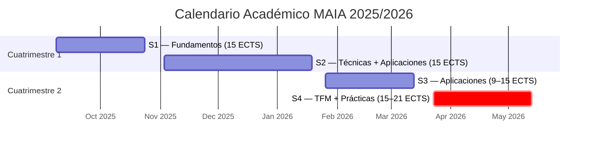

# Semicuatrimestres

> [← Volver al índice](README.md)

El máster se organiza en **4 semicuatrimestres** a lo largo de un curso académico. Cada semicuatrimestre dura aproximadamente 7-8 semanas.

---

## Calendario Aproximado (Curso 2025/2026)

| Semi | Cuatrimestre | Periodo aproximado | ECTS a matricular |
|------|-------------|--------------------|--------------------|
| S1 | 1er Cuatrimestre | Sep – Oct 2025 | **15 ECTS** |
| S2 | 1er Cuatrimestre | Nov – Dic 2025 / Ene 2026 | **15 ECTS** |
| S3 | 2o Cuatrimestre | Ene – Mar 2026 | **Entre 9 y 15 ECTS** |
| S4 | 2o Cuatrimestre | Mar – May 2026 | **Entre 15 y 21 ECTS** |

---

## Semicuatrimestre 1 (S1)

**Periodo:** septiembre – octubre 2025
**ECTS:** 15 (fijos)

### Obligatoria
| Código | Asignatura | ECTS | Módulo |
|--------|-----------|------|--------|
| 19197 | Implicaciones Éticas y Legales de la IA | 3 | M3 |

### Optativas — Fundamentos y Técnicas (elegir 12 ECTS)

**Fundamentos de la IA:**
| Código | Asignatura | ECTS |
|--------|-----------|------|
| 19204 | Aprendizaje Automático | 3 |
| 19200 | Búsqueda y Optimización | 3 |
| 19202 | Computación Evolutiva | 3 |

**Aprendizaje Automático Avanzado:**
| Código | Asignatura | ECTS |
|--------|-----------|------|
| 19199 | Aprend. Automático en Series Temporales y Flujos de Datos | 3 |
| 19203 | Redes de Neuronas | 3 |

**Razonamiento y Planificación:**
| Código | Asignatura | ECTS |
|--------|-----------|------|
| 19198 | Representación del Conocimiento y Razonamiento | 3 |
| 19205 | Agentes y Sistemas Multiagente | 3 |

**Modelos Probabilísticos e Incertidumbre:**
| Código | Asignatura | ECTS |
|--------|-----------|------|
| 19201 | Métodos Probabilísticos en IA | 3 |

---

## Semicuatrimestre 2 (S2)

**Periodo:** noviembre – diciembre 2025 / enero 2026
**ECTS:** 15 (fijos)

### Optativas — Fundamentos y Técnicas (elegir entre 3 y 12 ECTS)

**Aprendizaje Automático Avanzado:**
| Código | Asignatura | ECTS |
|--------|-----------|------|
| 19209 | Aprendizaje por Refuerzo | 3 |
| 19206 | Aprendizaje Profundo | 3 |

**Razonamiento y Planificación:**
| Código | Asignatura | ECTS |
|--------|-----------|------|
| 19207 | Planificación Automática | 3 |

**Modelos Probabilísticos e Incertidumbre:**
| Código | Asignatura | ECTS |
|--------|-----------|------|
| 19208 | Razonamiento con Incertidumbre | 3 |

### Optativas — Aplicaciones (elegir entre 3 y 12 ECTS)

**Técnicas Aplicadas:**
| Código | Asignatura | ECTS |
|--------|-----------|------|
| 19211 | Procesamiento de Lenguaje Natural | 3 |
| 19212 | Vehículos Autónomos | 3 |

**Aplicaciones:**
| Código | Asignatura | ECTS |
|--------|-----------|------|
| 19224 | Inteligencia Ambiental | 3 |

---

## Semicuatrimestre 3 (S3)

**Periodo:** enero – marzo 2026
**ECTS:** entre 9 y 15

### Optativas — Aplicaciones (elegir entre 9 y 15 ECTS)

**Técnicas Aplicadas:**
| Código | Asignatura | ECTS |
|--------|-----------|------|
| 19217 | Visión Artificial | 3 |

**Aplicaciones:**
| Código | Asignatura | ECTS |
|--------|-----------|------|
| 19213 | Web Semántica y Buscadores | 3 |
| 19214 | IA en Educación | 3 |
| 19215 | IA en Finanzas | 3 |
| 19216 | IA en Salud | 3 |
| 19218 | IA y Desarrollo Sostenible | 3 |
| 19219 | Robótica Inteligente | 3 |

---

## Semicuatrimestre 4 (S4)

**Periodo:** marzo – mayo 2026
**ECTS:** entre 15 y 21

### Obligatorias
| Código | Asignatura | ECTS | Tipo |
|--------|-----------|------|------|
| 19226 | Prácticas en Empresa | 6 | O |
| 19227 | Trabajo Fin de Máster | 6 | TFM |

### Optativas (elegir entre 3 y 9 ECTS)

**Técnicas Aplicadas:**
| Código | Asignatura | ECTS |
|--------|-----------|------|
| 19210 | Analítica de Negocio | 3 |

**Aplicaciones:**
| Código | Asignatura | ECTS |
|--------|-----------|------|
| 19222 | Fábricas Inteligentes | 3 |
| 19223 | Ciudades Inteligentes | 3 |

**Aspectos Éticos y Legales:**
| Código | Asignatura | ECTS |
|--------|-----------|------|
| 19225 | Emprendimiento en IA | 3 |

---

## Importante

- La impartición final de las asignaturas optativas está condicionada a un **mínimo de 25 estudiantes** matriculados.
- Consulta los **mínimos y máximos de ECTS por módulo** en el [Plan de Estudios](plan-de-estudios.md) para diseñar bien tu matrícula.
- Recuerda respetar los rangos de créditos tanto por semicuatrimestre como por módulo.

---

*Fuente: [Web oficial del Máster UC3M](https://www.uc3m.es/master/inteligencia-artificial-aplicada#programa)*
